<a href="https://abhijeet-ist.vercel.app">
  
</a>

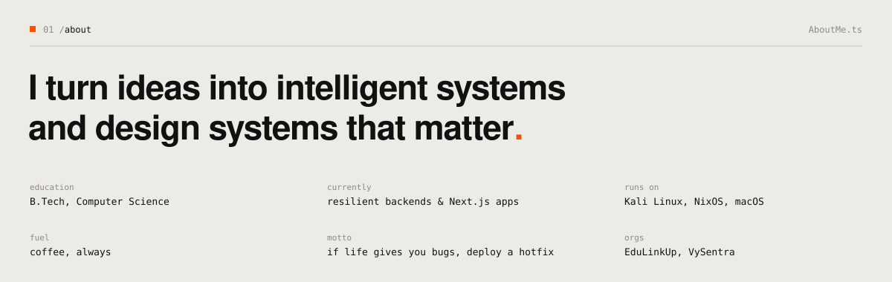
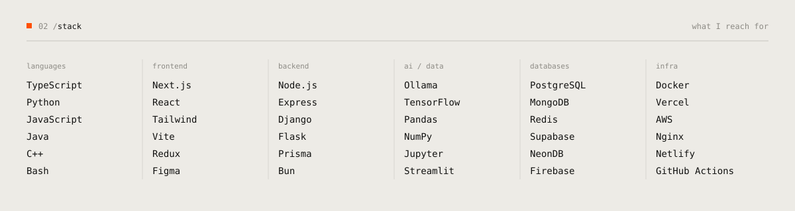

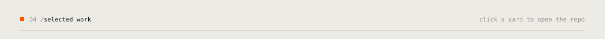

  <a href="https://github.com/Abhijeet-ist/Vyana">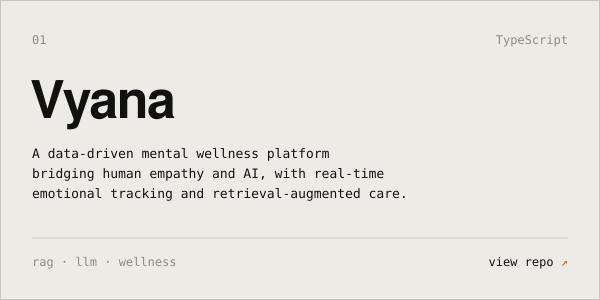</a>
  <a href="https://github.com/Abhijeet-ist/Chatbot-with-integrated-Bhagvad-Gita">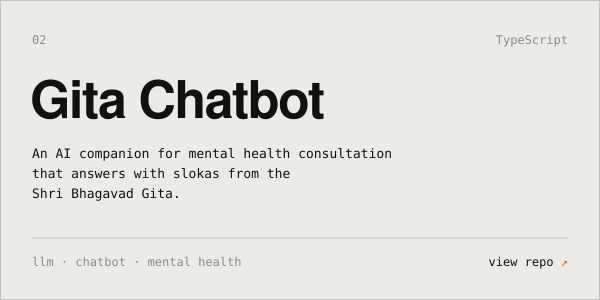</a>
  <a href="https://github.com/Abhijeet-ist/FineTunning">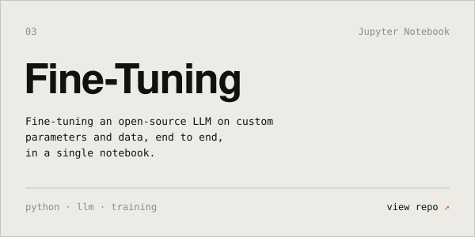</a>
  <a href="https://github.com/Abhijeet-ist/Beyond-Campus">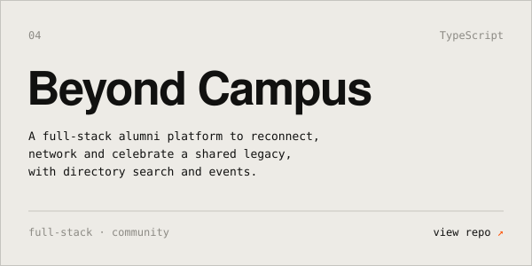</a>



<!--  -->
<!--  -->

<a href="https://github.com/Abhijeet-ist/Abhijeet-ist/issues/new?template=guestbook.yml">
  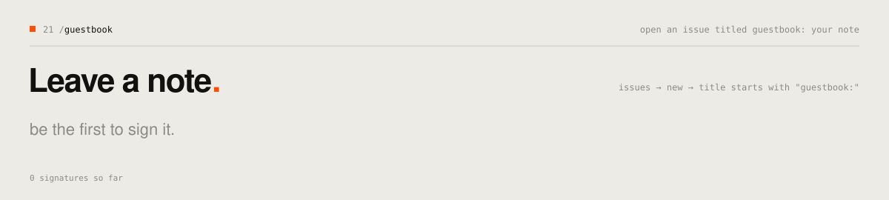
</a>

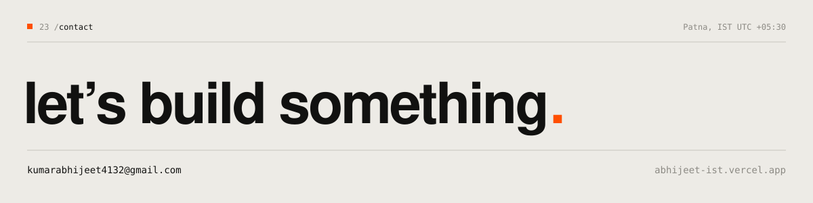

  <a href="https://www.linkedin.com/in/abhijeet-kr28/">linkedin</a> &nbsp;·&nbsp;
  <a href="https://x.com/abhijeet_ist">x</a> &nbsp;·&nbsp;
  <a href="https://instagram.com/abhijeet.ist">instagram</a> &nbsp;·&nbsp;
  <a href="https://www.hackerrank.com/@kumarabhijeet411">hackerrank</a> &nbsp;·&nbsp;
  <a href="https://auth.geeksforgeeks.org/user/abhijeet_ist">geeksforgeeks</a> &nbsp;·&nbsp;
  <a href="https://abhijeet-ist.vercel.app">portfolio</a>

© 2026 Abhijeet Kumar. Design and code, all rights reserved.

